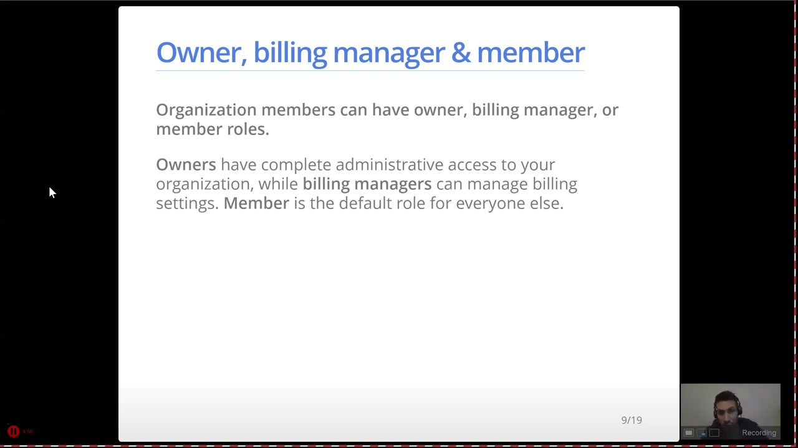
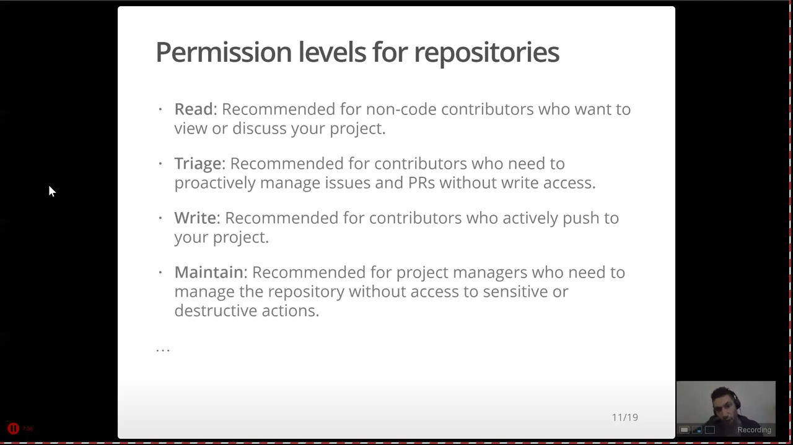
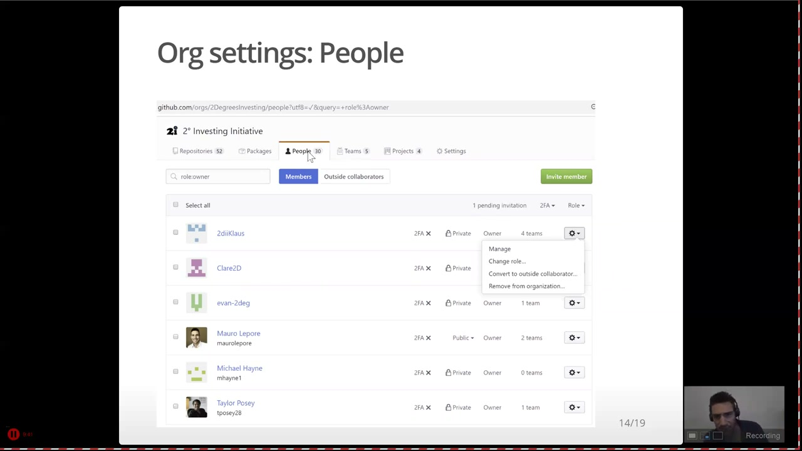
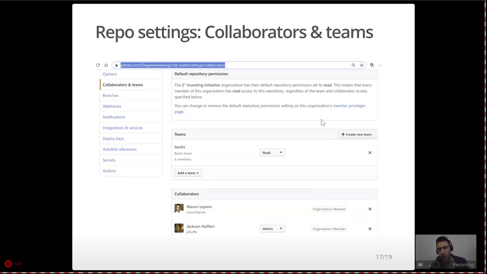
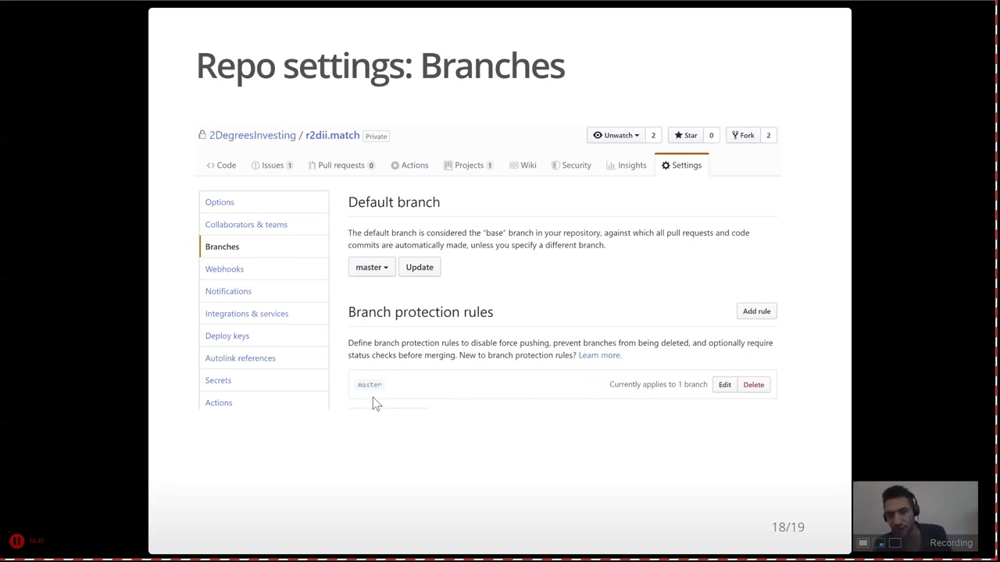
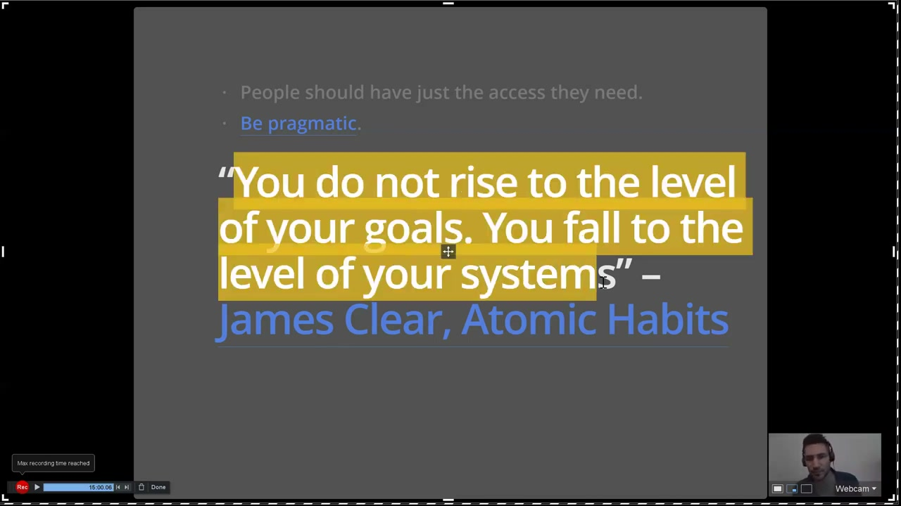

> [!WARNING]
> 

What may look different today

>
> - Classic branch protection rules now sit alongside rulesets, which can target many repositories at once, layer on the same branch, and be toggled without deletion.
> - Organizations on Enterprise Cloud can define custom repository roles beyond Read, Triage, Write, Maintain, and Admin.
> 

Welcome again to the DS Incubator. Today we are talking about access permissions for a GitHub organization.

The goal is to answer four uncomfortable questions: what are you inside an organization, what can you do inside a repository, what do you get by default, and what breaks when you get it wrong. Most of us learn the answers only after a mistake, so let us learn them from my mistakes instead. Keep It Super Simple: know your role before you push.

This is for anyone who works in a GitHub organization, particularly if you contribute code through forks and pull requests without quite knowing what your clicks are allowed to destroy.

**Objectives:**
1. Are you the owner, member, or collaborator of a GitHub organization?
2. Do you have rights to admin, write, or read a GitHub repository?
3. As a member of a GitHub organization or team, what access level do you get by default to all repos?
4. What consequences are there to a mistake depending on your role or access level?

## Owner, member, or collaborator?

To motivate this, imagine you want to propose changes to a source repository in our organization. The happy path is familiar: fork, clone locally, branch for the pull request, push to your fork, open the pull request. I do it all the time, and I still get two things wrong: I copy the URL of the source repo instead of my fork, or I start committing on the master branch instead of a pull-request branch. The question is what happens when I then push — and that depends entirely on my role.

Organization members come in three flavors. Owners have complete administrative access to everything, including repositories they do not even know exist. Billing managers handle billing settings, which is not exciting for what we do, so I skip them. Everyone else is a member, and owners set one default permission that applies to every member on every repository — set it to admin and every member can suddenly delete repositories they never heard of.

## Admin, write, or read?

Zooming into a single repository, the permission ladder runs from least to most powerful. Read lets you see everything and discuss it, which is exactly right for someone managing a project without intending to commit anything — and with the fork-and-pull-request workflow, read access is still enough to contribute. Write lets you push, which active developers need but which gets me in trouble regularly, since pushing straight to the wrong branch rewrites shared history. Admin is the most powerful and the most dangerous: it allows destructive actions like deleting the repository or changing its security settings, so it demands the most responsibility.

Organization owners hold admin on every repository by default. I am an owner of ours, which means I can delete a repository a colleague created yesterday without ever having seen it. That is something to carry with a lot of responsibility.

## Six owners who did not all know it

The People tab of our organization lists 30 members. Filtering by role shows six owners: Klaus, Claire, Evan, me, Michael, and Taylor. I am not sure we all knew we were owners, yet each of us can change anyone's role, convert members to outside collaborators, or remove people from the organization entirely. Power nobody remembers having is the most dangerous kind, because nothing stops you from using it by accident.

## Three channels into one repository

Defaults are only the first of three channels through which someone gets access to a specific repository. On one of ours, the base member permission is read, so every member of the organization can read it. The banks team also gets read on it, because that team works through pull requests and needs nothing more. But Jackson, who builds and manages the project's board, needed admin on just this repository — so I added him as an individual collaborator with admin, without granting it to the whole team. One repository, three channels: what everyone gets, what your team gets, and what you personally get.

## Protect the branch you cannot rewrite

The last line of defense sits at the branch level. A rule matching master can disable force pushes, so people can add commits but can never rewrite history that is already there. Rewriting published history is the mistake that turns a small embarrassment into everyone else's lost afternoon, and a branch rule prevents it mechanically instead of relying on everybody remembering.

## Takeaways

Two pieces of advice compress the whole talk. First, people should have just the access they need and no more — I prefer not being an owner on repositories where I only contribute, because then pushing to master is simply not possible for me. Second, be pragmatic in the systems sense: you do not rise to the level of your goals, you fall to the level of your systems. No matter how strongly we want to do things right, without a good system in place we will eventually forget something and land in trouble. Guardrails like branch protection and the smallest sufficient permission are that system.

## Resources
- [Slides](https://github.com/2DegreesInvesting/ds-incubator/blob/master/2019-11-26_access-permissions-on-github.pdf).
- [Original material](https://github.com/2DegreesInvesting/ds-incubator/issues/14).
- [Meetup on YouTube](https://www.youtube.com/watch?v=z4RAuGrAm8c).
- [Repository roles for an organization](https://docs.github.com/en/organizations/managing-user-access-to-your-organizations-repositories/managing-repository-roles/repository-roles-for-an-organization).
- [About rulesets](https://docs.github.com/en/repositories/configuring-branches-and-merges-in-your-repository/managing-rulesets/about-rulesets).
