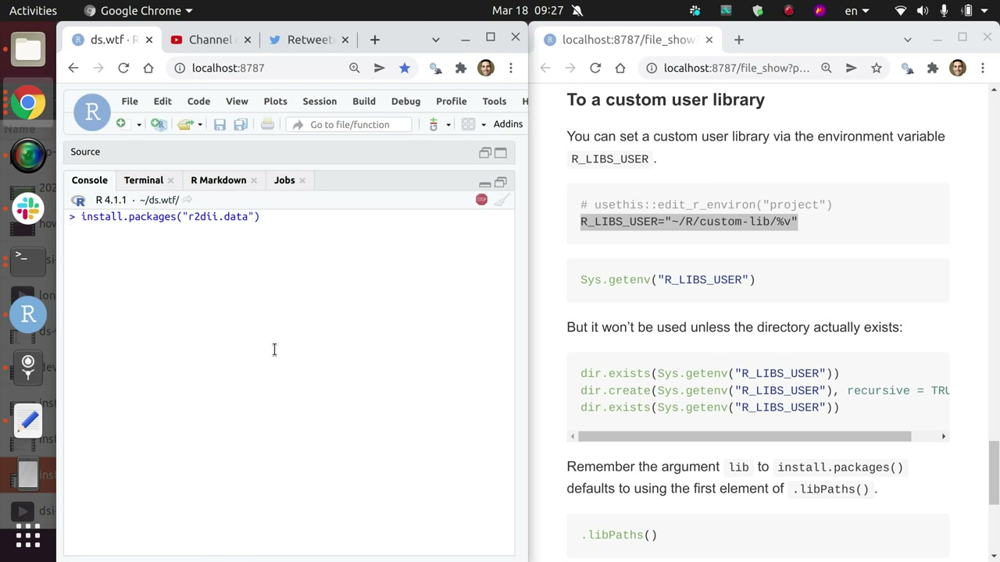
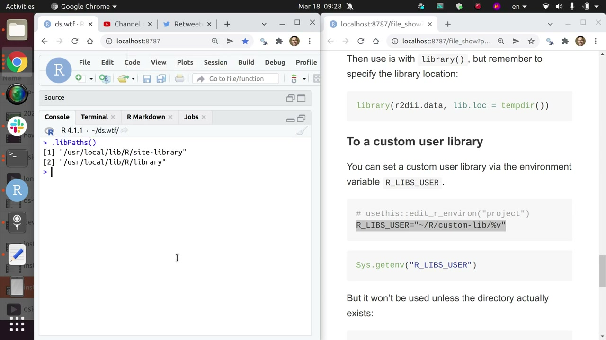
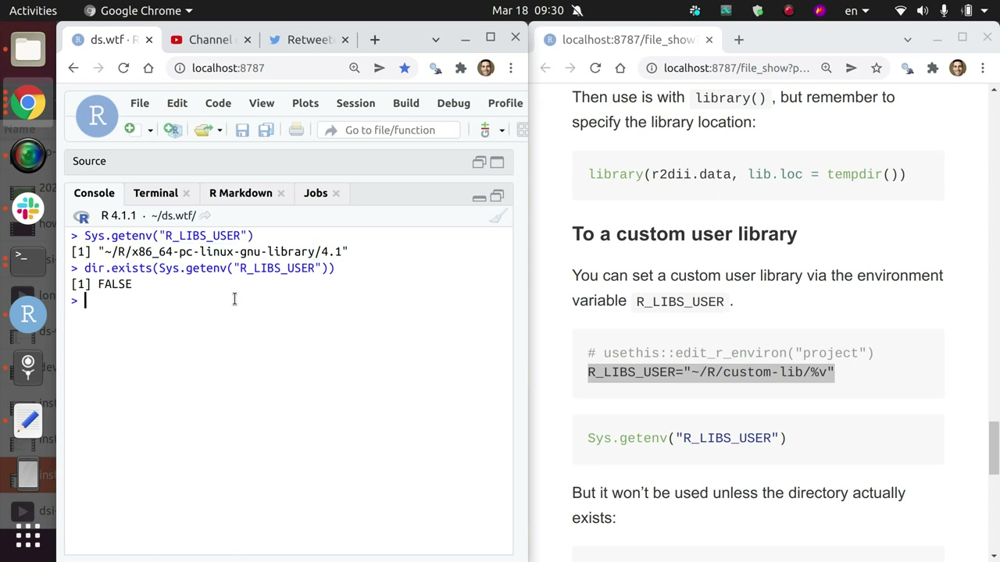
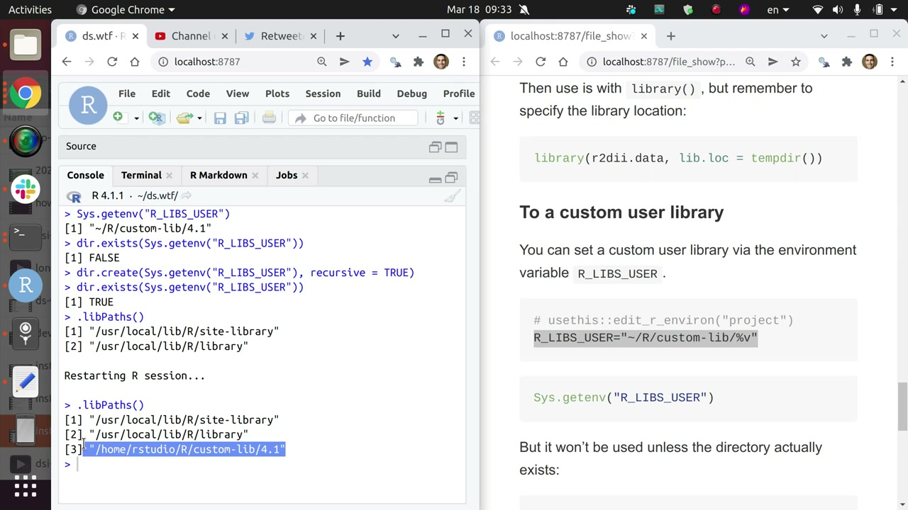
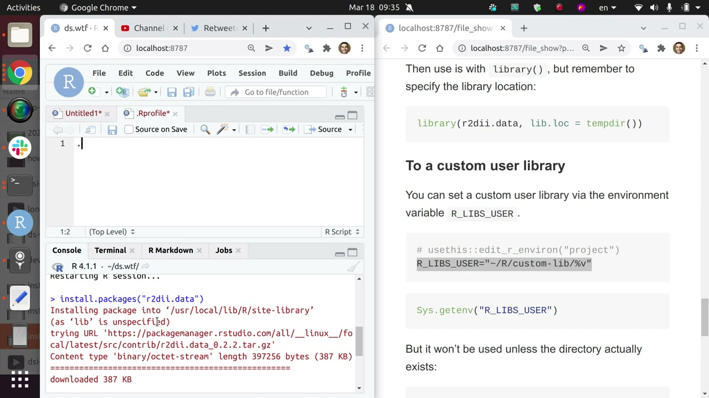

> [!WARNING]
> 

What may look different today

>
> - RStudio Package Manager is now Posit Package Manager — the package-manager URLs in the material still resolve, but new setups should start from Posit Package Manager.
> 

This video shows how to control where your packages go, and specifically how to set up a custom user library. It extends the ds-incubator meetup on installing R packages, which stops at the temporary library — the more general use case. A custom user library comes in useful occasionally, and here is the record for when it does.

The goal is to install packages just for you on a shared system instead of into the site-level library everyone shares. This is for anyone who installs R packages on a machine they do not administer alone, particularly a shared Docker container or server where every install lands somewhere public.

**Objectives:**
1. See where `install.packages()` puts packages by default and why that hurts on shared systems.
2. Point the `R_LIBS_USER` environment variable at a versioned custom directory.
3. Move the custom library to the front and make the setup permanent.

## Where packages go by default

Calling `install.packages("r2dii.data")` with the package name alone prints where it lands: in my case `/usr/local/lib/R/site-library`, a path with no username in it. I work in a Docker container on a Linux system shared across multiple users, so every package I install there is visible to everybody else. If you are that user and want packages just on your system, the second argument to `install.packages()`, `lib`, is what specifies where they go.

## The default is the first element of `.libPaths()`

The `lib` argument, when missing, defaults to the first element of `.libPaths()`. That function prints every library you have set up, and its first entry is the one installs use. Inspecting it with `list.files()` shows two kinds of residents: the packages that come out of the box with R, which live in a separate system path, and the ones you installed as a user. Knowing which is which is the whole game.

## Name it with `R_LIBS_USER`, then create it

The trick is the environment variable `R_LIBS_USER`, the one that specifies where user packages should go. I set it in the project `.Renviron` via `usethis::edit_r_environ("project")` to something like `~/R/custom-lib/%v`, where `%v` expands to the minor R version so each R version gets its own directory. Two details matter: end the `.Renviron` file with a newline and nothing else, and remember the variable alone changes nothing — the directory has to actually exist, so `dir.exists()` returns false until I create it recursively.

## Front of the line, but only for this session

Creating the directory is necessary but not sufficient: after a restart the new path appears in `.libPaths()`, yet down in third place — and installs default to the *first* element. Passing the variable through `.libPaths()` itself — `.libPaths(Sys.getenv("R_LIBS_USER"))` — moves the custom library to the front. But restart R and reinstall, and the package lands elsewhere again: I changed only this session, nothing permanent.

## Make it permanent in `.Rprofile`

The permanent fix lives in `.Rprofile`, which R inspects at the start of every session. I open the project profile with `usethis::edit_r_profile("project")` and put the same `.libPaths(Sys.getenv("R_LIBS_USER"))` call there. Restart once more, confirm `.libPaths()` opens with the custom library, and `install.packages("r2dii.data")` finally lands where I want — in every session from now on.

## Takeaways

Three habits make user libraries painless: version the path with `%v` so R upgrades never collide, always end `.Renviron` with a bare newline, and put session-only experiments in the console but permanent setup in `.Rprofile`. With that, your packages stay yours even on a machine you share with everyone.

## Resources
- [Original material](https://github.com/2DegreesInvesting/ds.wtf/tree/main/02_personal-r-admin).
- [Meetup on YouTube](https://www.youtube.com/watch?v=sbp5Q8niTho).
- [Posit Package Manager](https://packagemanager.rstudio.com/client/#/repos/1/overview).
