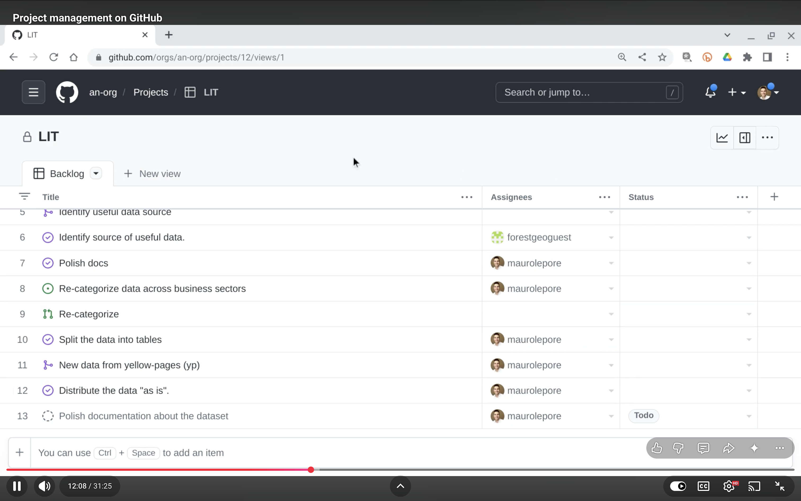
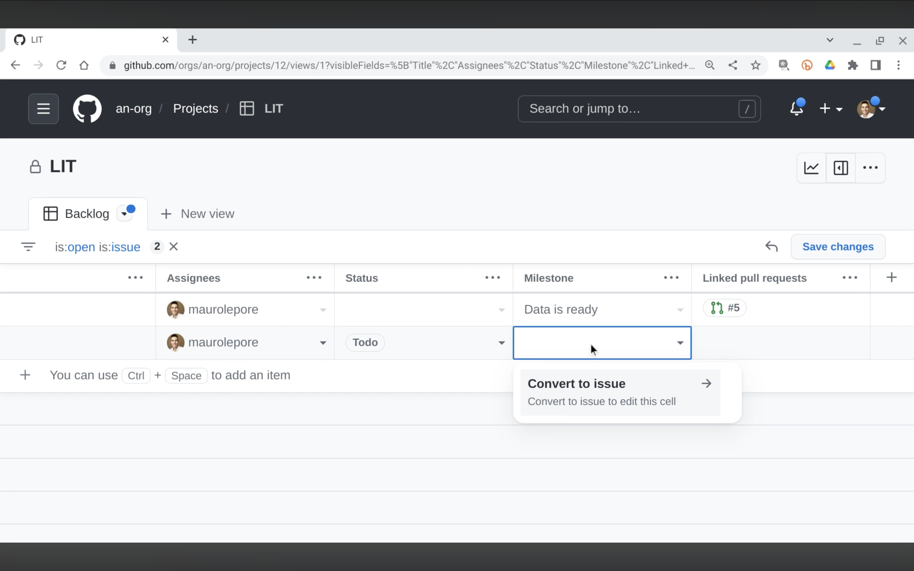
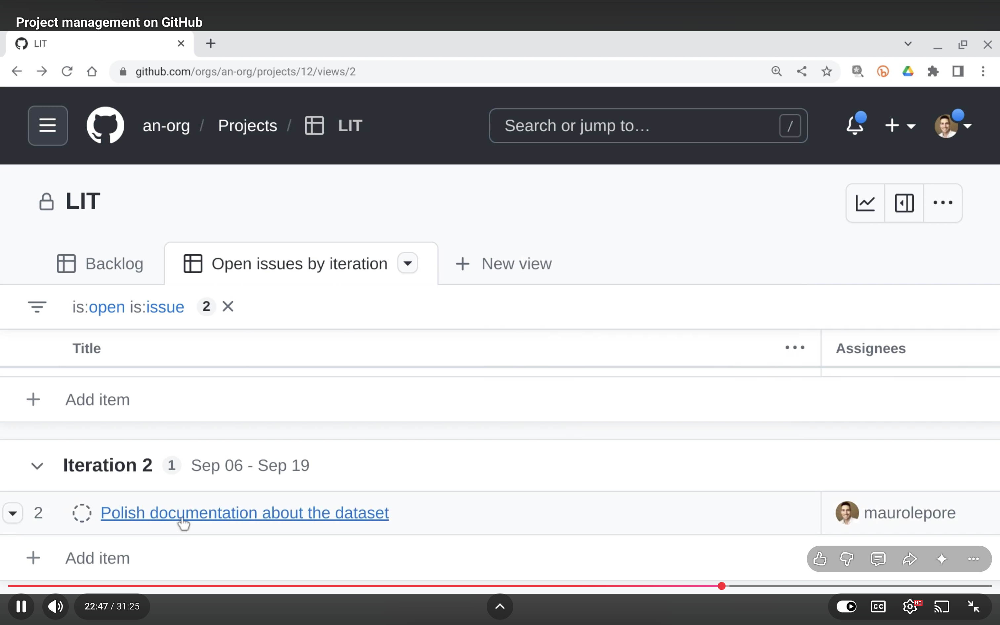
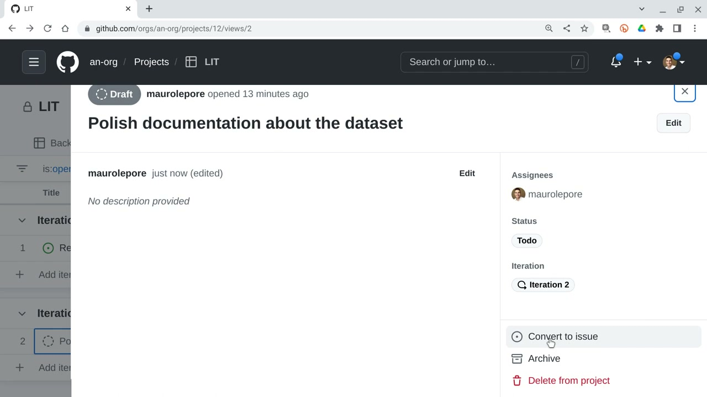
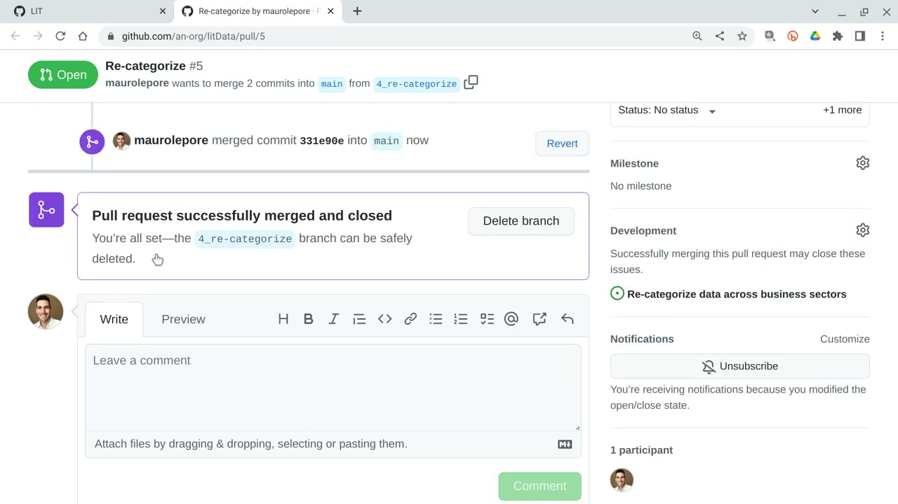

# Project Management on GitHub

> [!WARNING]
> Produced on Aug 23, 2022.
> 

What may look different today

>
> - Milestone and Linked pull requests are now added as organization issue fields, not merely unhidden.
> - Iteration is a built-in field that auto-creates iterations with configurable duration and breaks.
> - Built-in workflows now auto-set status to Done when pull requests merge or close, so the merge-to-Done step is automatic by default.
> - Projects can start from Table, Board, or Roadmap.
> 

Welcome again to the DS Incubator. Today we are talking about project management on GitHub.

The goal is to show that we can manage projects with GitHub with very little overhead. The focus is mostly on project managers who manage projects that have some aspect involving GitHub.

Because most of the code lives on GitHub around the globe, and if the code is already there, maybe it makes sense to use that platform to manage the projects themselves. Then we don't need any extra, possibly complicated piece of software. Basically, the idea is to Keep It Super Simple.

This is for anyone who needs to manage a project, particularly if some aspect of it involves GitHub, including analysts, developers, and project managers.

**Objectives:**

1. Manage a project from the perspective of a project manager (the two project-manager sections below) — this takes most of the meetup.
2. Manage a project from the perspective of an analyst/developer (the analyst/developer section) — this takes only a little time.
3. Watch updates and track linked work (the watch-updates section).

## As a project manager

The very first thing you could do is create a GitHub account if you don't have one. Luckily it is free. All the features I show here are available for free accounts, including keeping everything private, which is the default when creating projects.

A GitHub organization is a collection of folders that live on GitHub. You can imagine it as similar to a Dropbox account, where inside that account you have a bunch of little folders. Here I have one that I use for demos, called `an-org`. It has a Projects tab with a green button to create a project, which opens the interface for adding details and work items.

The project creation dialog offers starting from scratch with a table or a board, or starting from a template, which is a partly developed version of what we build today. I start from scratch, from a table.

I name the project LIT. I am pretending we have a project called LIT, about getting data on companies from Lithuania, which some of us may find similar to another real project we work on.

With the empty project ready, I build a backlog of all the work items for the project.

Some background: let us pretend this project has already been running for some time and we adopt this tool only now. The analysts and developers have already been busy, so there is already work in GitHub repositories. I pull all that existing work into the backlog.

This project has two repositories. One is called `litCode`, which holds the code that automatically downloads company data from a website like Yellow Pages. The team already identified which websites and variables were useful and wrote the download code. The other is called `litData`, which hosts the scraped data so analysts can access and shape it.

The project table works a little like an Excel sheet. Its Add item row offers two options: create a draft issue, or add existing issues and pull requests from a repository. Pretend I am the project manager in a meeting, asking the team what they have been up to, and they point me to those two repositories. I import everything from both.

GitHub jargon helps read the table: items in green are open, ongoing, or still to do; items in purple were already worked on. Each row shows a title, assignees who picked up the task while working, and a status column that is still mostly empty.

That covers only work already done. I also add upcoming work as a draft issue titled "Polish documentation about the dataset" and assign it to Mauro, who already carries several tasks. Its status is Todo: not done, not in progress, but due soon.

That table, renamed to Backlog, is now the full collection of what happened and what needs to happen: a long list that is still hard to read at a glance, with no clear sense of what is due by whom and by when.

The same data has a second layout worth knowing: the board, usually called Kanban. Dragging a card from one column to another edits the underlying table. Moving the draft from Todo to In Progress changes its status cell, and moving it back restores Todo. Table and board are just two views of the same data. Some metadata, like assignee and status, is entered by hand, but as we will see, status can also flip automatically when work happens.

To make the backlog readable, I design a focused view: open issues by iteration.

First I unhide two useful columns the way Excel unhides columns: Milestone and Linked pull requests. The team already agreed on milestones and tagged their work with them, which makes grouping meaningful. Linked pull requests connect each issue, the conversation about work to do, with its implementation, the actual work that followed.

Next I organize: group by milestone, then filter to open issues only. The filter syntax is `is:open is:issue`. Issues alone are enough here because every pull request follows an issue, and the linked pull request column already shows the associated work. The full backlog shrinks to two open issues, which also makes it easier to spot gaps the developers never filled in.

One gap surfaces immediately: the draft about documenting the data belongs to the "Data is ready" milestone, but a draft cannot hold a milestone. Assigning it is the assignee's job during conversion to a real issue, so as project manager I leave the milestone empty for now and set what I can: the older item is already being worked on, so it becomes In Progress.

Then I create a genuinely new column. Unlike Milestone, Iteration does not exist yet, so I add a New field of type Iteration. Like an Excel column type for text, dates, or numbers, Iteration is GitHub's built-in cadence type. I keep the default two-week length. The item already in progress joins the current iteration with its dates filled in; the documentation task, which would be rushed now, goes to the next iteration. Grouping by Iteration then shows clearly what is due now versus later.

Rather than overwriting the Backlog, I use Save changes as a new view and name it "Open issues by iteration". Both views now exist side by side over exactly the same data, each with its own shareable URL for stakeholders, developers, analysts, or product owners. Opening the Backlog confirms it is unchanged.

## As an analyst / developer

Switching hats to analyst and developer, the work starts from that shared view. The assignee opens the draft, which is easy to find and could also be filtered by assignee, and converts it to a real issue to make the planned work official.

Conversion assigns the issue to the `litData` repository, since it documents the data, and turns its gray draft marker green. In the issue editor I add the missing milestone, "Data is ready", confirm no pull requests are linked yet, and move status from Todo to In Progress as work begins.

The project reflects all of this automatically. What was a gray draft circle is now a green issue circle with the analyst's metadata already in place, no manual table edit needed.

## Watch updates and track linked work

The same automation covers real code changes. An open pull request is linked directly from the project row, so from the high-level board I jump straight to the work for review. As analyst and developer, I merge it once a colleague has reviewed it, putting the change into production.

Refreshing the project board shows the effect: the associated issue is closed, its status flipped automatically to Done, and its linked pull request turned from green to purple. Everyone tracking the project, manager or developer, sees the same update without extra reporting.

## Takeaways

GitHub Projects are user friendly, even if you don't write code. If your code is already on GitHub anyway, managing the project there too avoids adding another tool that brings complexity without much value. Because everything happens on the same platform, everything stays linked and updates automatically.

Thanks to Mirja, Iago, and Matthias for conversations about project management on GitHub that led to this meetup.

## Resources

- [Planning and tracking with Projects](https://docs.github.com/en/issues/planning-and-tracking-with-projects).
- [Original material on GitHub](https://github.com/2DegreesInvesting/ds.misc/blob/main/2022-08-23_ds.gh-projects/README.md).
- [Meetup on YouTube](https://www.youtube.com/watch?v=qqKhQdejUOM&t).
- [Creating a project](https://docs.github.com/en/issues/planning-and-tracking-with-projects/creating-projects/creating-a-project).
- [Understanding fields](https://docs.github.com/en/issues/planning-and-tracking-with-projects/understanding-fields).
- [Managing items / converting drafts](https://docs.github.com/en/issues/planning-and-tracking-with-projects/managing-items-in-your-project).
- [Customizing views](https://docs.github.com/en/issues/planning-and-tracking-with-projects/customizing-views-in-your-project).
