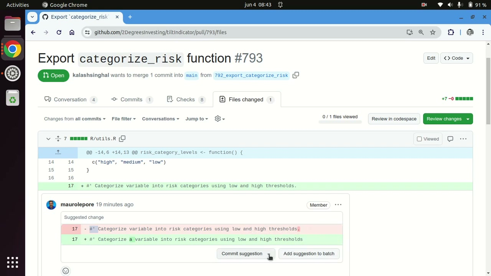
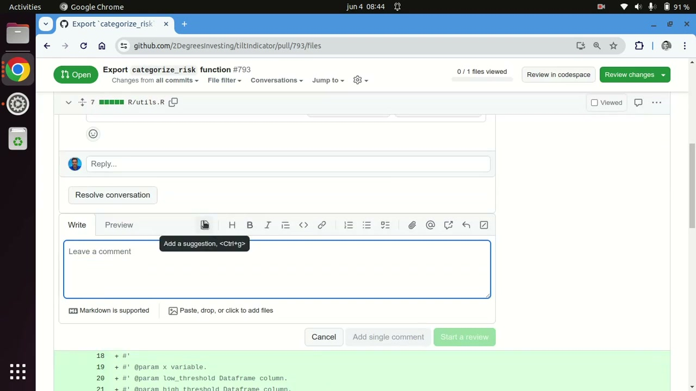
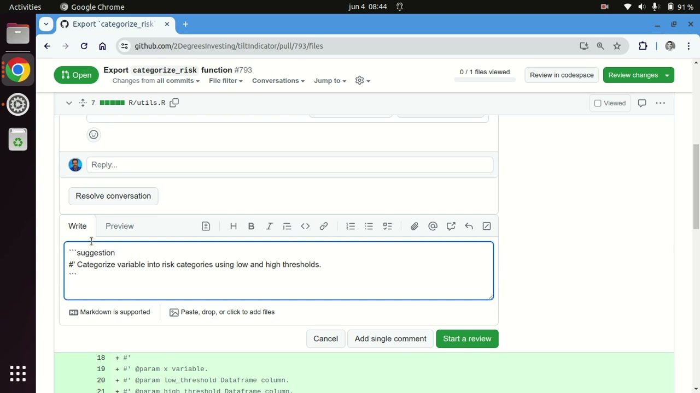

Here is a tip to help you review pull requests more quickly, for anyone who catches small fixes while reading diffs. Instead of describing a one-line fix in prose, I propose the exact change so the author can commit it directly — no checkout, no patch file, no copy-paste.

I open the Files changed tab — here Export `categorize_risk` function #793 — and write the suggestion on the line I want changed. The comment shows the line in red as it was before and in green as it is now, with a menu underneath where the author chooses Commit suggestion or adds it to a batch of changes.

This works on any one line or range of lines. Hovering reveals an easy-to-miss icon that says Add a suggestion; clicking it inserts a code chunk labeled `suggestion`. You do not even need the icon — typing triple-backtick `suggestion` in any pull request comment creates the same block the author commits from.

From there I either start a review when more suggestions are coming or send it as a single comment, since pending comments stay mine-only until submitted. Suggesting the change beats describing it, and the full flow is documented in [Reviewing proposed changes in a pull request](https://docs.github.com/en/pull-requests/collaborating-with-pull-requests/reviewing-changes-in-pull-requests/reviewing-proposed-changes-in-a-pull-request#starting-a-review) — see the [82-second video](https://www.youtube.com/watch?v=ciJpIWs3t3k).

